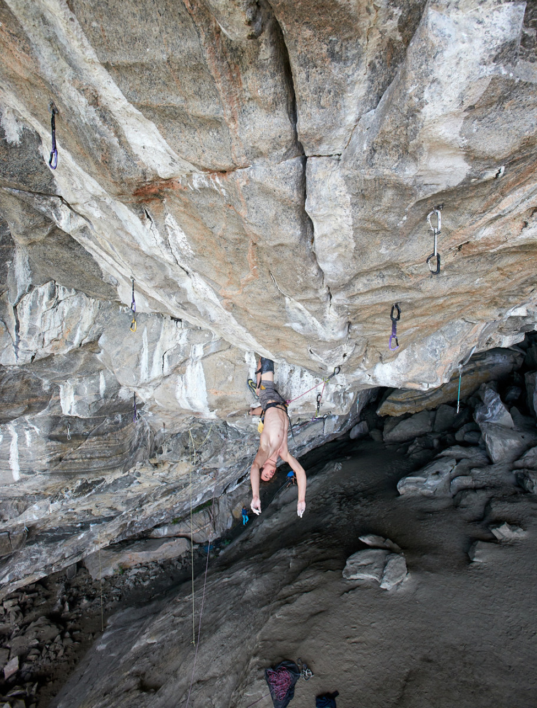

# Rock Climbing Analysis

This github repository contains the input and resulting graphs of the analysis that I performed on the [8a.nu Logbook](https://www.kaggle.com/dcohen21/8anu-climbing-logbook) information in support of a [Data Story](https://medium.com/@buckthecanuck/climb-through-the-data-with-me-80fb144ea408) I wrote about rock climbing.

Rock Climbing is a relatively new passion of mine and in the story I give some background of how I came into the sport. I then proceed to perform an exploration of the data in the logbook. This repository contains all of the preprocessing and analysis that was used to create the medium post.

As a bonus, here is a picture of the best rock climber in the world resting on the hardest climb in the world (only he has climbed it).

